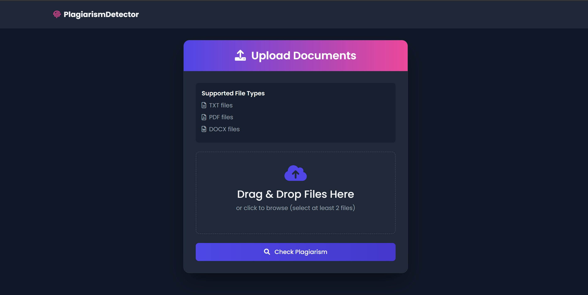
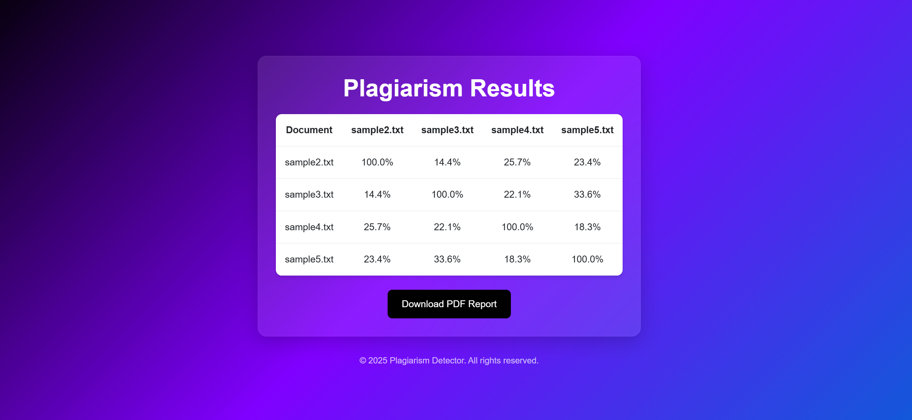

#Plagiarism Detector
# Plagiarism Detector

A web application that detects plagiarism between multiple documents using TF-IDF and cosine similarity.

## Features

- Supports multiple file formats: TXT, PDF, and DOCX
- Preprocesses text (tokenization, stopword removal, normalization)
- Calculates similarity scores between documents
- Generates a PDF report of the results
- Modern, responsive UI with drag-and-drop file upload

## Technologies Used

- **Backend**: Python with Flask
- **Frontend**: HTML5, CSS3, Bootstrap 5
- **Text Processing**: NLTK for tokenization and stopword removal
- **File Handling**:
  - PDF: pdfplumber
  - DOCX: python-docx
  - PDF Report Generation: reportlab
- **Similarity Calculation**: scikit-learn (TF-IDF Vectorizer and cosine similarity)

## Installation

1. Clone the repository:
   ```bash
   git clone https://github.com/yourusername/plagiarism-detector.git
   cd plagiarism-detector
   ```

2. Create a virtual environment and activate it:
   ```bash
   python -m venv venv
   source venv/bin/activate  # On Windows use `venv\Scripts\activate`
   ```

3. Install the required dependencies:
   ```bash
   pip install -r requirements.txt
   ```

4. Download NLTK data:
   ```python
   python -c "import nltk; nltk.download('punkt'); nltk.download('stopwords')"
   ```

## Usage

1. Run the Flask application:
   ```bash
   python app.py
   ```

2. Open your web browser and navigate to:
   ```
   http://localhost:5000
   ```

3. Upload at least two documents (TXT, PDF, or DOCX) and click "Check Plagiarism"

4. View the similarity matrix and download the PDF report

## Project Structure

```
plagiarism-detector/
│
├── app.py                # Main Flask application
├── templates/
│   ├── upload.html       # File upload page
│   └── results.html     # Results display page
├── uploads/              # Directory for uploaded files
├── static/              # Static files (CSS, JS, images)
├── requirements.txt      # Python dependencies
└── README.md            # This file
```

## Requirements

- Python 3.7+
- See `requirements.txt` for all Python dependencies

## License

This project is licensed under the MIT License - see the [LICENSE](LICENSE) file for details.

## Screenshots







## Contributing

Contributions are welcome! Please open an issue or submit a pull request for any improvements.

1. Fork the project
2. Create your feature branch (`git checkout -b feature/AmazingFeature`)
3. Commit your changes (`git commit -m 'Add some AmazingFeature'`)
4. Push to the branch (`git push origin feature/AmazingFeature`)
5. Open a Pull Request

## Acknowledgments

- Flask and Bootstrap for the web framework and UI
- scikit-learn for text processing and similarity calculations
- NLTK for natural language processing utilities